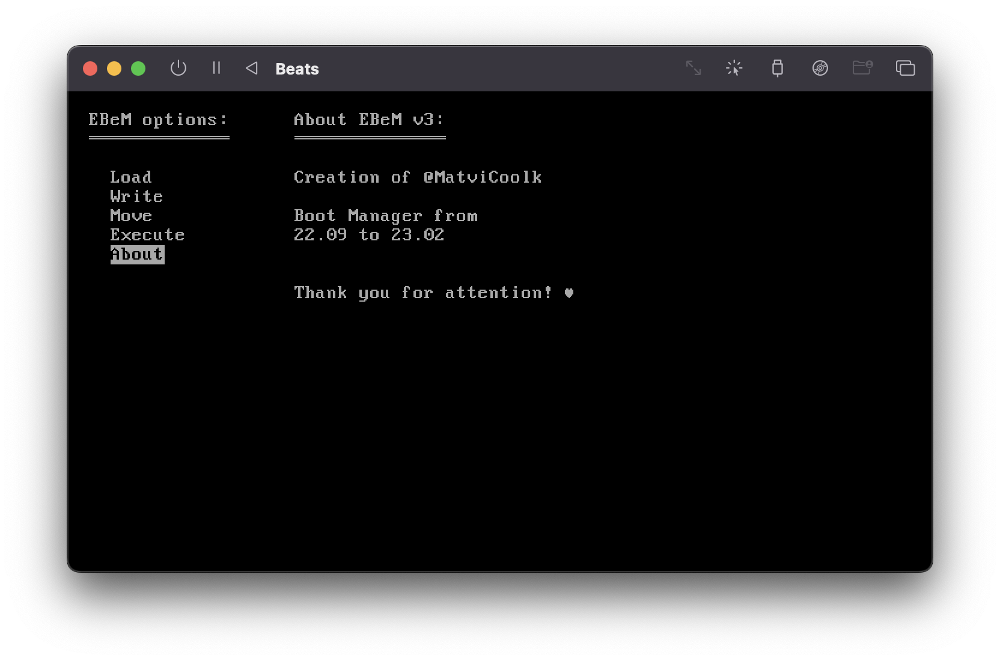

# About Beats
Bootable floppy image with boot manager and FAT reader.\
\
Graphics: MDA 
* Only video mode 7
* Text resolution: 80 x 25
* Pixel resolution: 720 x 350

Contains: a full working floppy image (9kb)
* Boot sector
* Boot sector for EBeM
* EBeM (16 sectors = 8kb)

###### Sorry, no Windows builder for now

> Entirely written in assembly without C (and always will be).\
> Only 8086 instruction, so no 64 or 32 bit calculations.

# Preview
###### UTM VM Look

